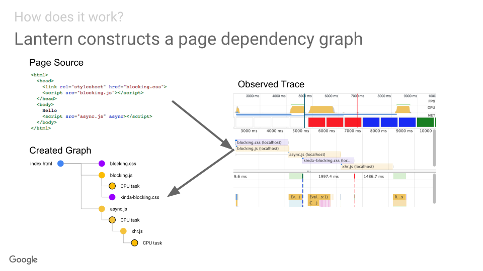

# What's in the Google PageSpeed score?

- [Overview](#overview)
  * [PageSpeed Insights score = Lighthouse](#pagespeed-insights-score--lighthouse)
  * [The 5 metrics that affect the score](#the-5-metrics-that-affect-the-score)
  * [Metrics estimation: Lantern](#metrics-estimation-lantern)
  * [Recommendations for using the score](#recommendations-for-using-the-score)
- [How metrics are estimated?](#how-metrics-are-estimated)
- [`pagespeed-score` cli](#pagespeed-score-cli)
  * [Local mode](#local-mode)
  * [Debugging metrics simulation locally (Lantern)](#debugging-metrics-simulation-locally-lantern)
  * [All options](#all-options)

## Overview

### PageSpeed Insights score = Lighthouse score

The [Google PageSpeed Insights (PSI)](https://developers.google.com/speed/pagespeed/insights/) score is based on [Google Lighthouse (LH)](https://developers.google.com/web/tools/lighthouse/).

**Lighthouse calculates the performance score on the scale of 0-100 based on 5 estimated metrics.**

The score of 90-100 is fast, 50-89 is average and 0-49 is slow.

### The 5 metrics that affect the score

This is available in the [Lighthouse scoring documentation](https://github.com/GoogleChrome/lighthouse/blob/master/docs/scoring.md). See a summary of metrics, their weights in the score and their maximum values to achieve the score of 90 and 50 in the table below:

| Estimated Metric            | Weight |  90  |  50  | Description |
|:----------------------------|:------:|:----:|:----:|-------------|
| First Contentful Paint (FCP)|    3   | 2.4s | 4.0s | when the first text or image content is painted |
| First Meaningful Paint (FMP)|    1   | 2.4s | 4.0s | when the primary content of a page is visible |
| Speed Index (SI)            |    4   | 3.4s | 5.8s | how quickly the contents of a page are visibly populated |
| First CPU Idle (FCI)        |    2   | 3.6s | 6.5s | when the main thread is first quiet enough to handle input |
| Time to Interactive (TTI)   |    5   | 3.8s | 7.3s | when the main thread and network is quiet for at least 5s |

**Other audits have no direct impact on the score** (but give hints to improve the metrics).

### Metrics are estimated with Lantern

**[Lantern](https://github.com/GoogleChrome/lighthouse/blob/master/docs/lantern.md) is the part of Lighthouse that estimates metrics.**

* **Lantern models page activity and simulates browser execution.** 
* It can also emulate mobile network and CPU execution based on only a performance trace captured without any throttling.
* (hence the fast execution time).

There’s an [accuracy and variability analysis](https://docs.google.com/document/d/1BqtL-nG53rxWOI5RO0pItSRPowZVnYJ_gBEQCJ5EeUE/edit#) available. Lantern trades off accuracy but also mitigates certain sources variability.

Metrics can be over/underestimated because of:
* differences in the unthrottled trace vs real device/throttling
* details ignored or simplified to make the simulation workable

### Recommendations for using the score

* Even if not 100% accurate **metrics in the red highlight genuine/urgent problems**
* Use the scores to **look for longer term trends and identify big changes**
* Reduce variability by forcing AB test variants, doing multiple runs, etc
* Keep in mind that even with reduced variability some inherent inaccuracies remain
* Use the `pagespeed-score` cli to reduce/identify variability and to investigate inaccuracies

## How does Lantern estimate metrics?

Lantern is an ongoing effort to reduce the run time of Lighthouse and improve audit quality by modeling page activity and simulating browser execution. Metrics are estimated based on:

* capturing an unthrottled network and CPU trace (usually referred to as observed trace)
* simulating browser execution (with emulated mobile conditions) using relevant parts of the trace

See detailed breakdown of steps below.

### 1. Create a page dependency graph from the observed (unthrottled) trace 
* Lighthouse loads the page without any throttling
* A dependency graph is built based on the network records and the CPU trace
* Any CPU tasks and network requests related to each other are linked up
* See [lighthouse-core/computed/page-dependency-graph.js](https://github.com/GoogleChrome/lighthouse/blob/master/lighthouse-core/computed/page-dependency-graph.js)

> 

(via [Project Lantern Overview - slide 7](https://docs.google.com/presentation/d/1EsuNICCm6uhrR2PLNaI5hNkJ-q-8Mv592kwHmnf4c6U/edit?zx=ksqkx77n311n#slide=id.g2ab7b9a053_0_467) by [@patrickhulce](https://github.com/patrickhulce))

## `pagespeed-score` cli

[](https://travis-ci.org/csabapalfi/pagespeed-score/)
[](https://coveralls.io/github/csabapalfi/pagespeed-score)

Command line toolkit to get a speed score and metrics via the Google PageSpeed Insights API or a local Lighthouse run. 

```
$ npx pagespeed-score --runs 3 https://www.google.com
name  	score	FCP	FMP	SI	FCI	TTI
run 1 	96	0.9	1.0	1.2	3.1	3.9
run 2 	96	0.9	1.0	1.0	3.1	3.7
run 3 	95	0.9	1.0	1.2	3.5	4.0

median	96	0.9	1.0	1.2	3.1	3.9
stddev	0.6	0.0	0.0	0.1	0.2	0.2
min   	95	0.9	1.0	1.0	3.1	3.7
max   	96	0.9	1.0	1.2	3.5	4.0
```

### Local mode

`--local` switches to running Lighthouse locally instead of calling the PSI API. This can be useful for non-public URLs (e.g. staging environment on a private network). To ensure the local results are close to the PSI API results this module:

  * uses the same version of LightHouse as PSI
  * uses the [LightRider mobile config](https://github.com/GoogleChrome/lighthouse/blob/master/lighthouse-core/config/lr-mobile-config.js)
  * allows throttling of CPU with `--cpu-slowdown` (default 4x)

Local results will still differ from the PSI API because of local hardware and network variability.

### Debugging metrics estimation (Lantern) locally 

`--lantern-debug --save-assets --local` will also save traces for metrics simulations run by Lantern

```
$ npx pagespeed-score \
--local --lantern-debug --save-assets https://www.google.com
```

You can open any of these traces in the Chrome Devtools Performance tab. 

See also [lighthouse#5844 Better visualization of Lantern simulation](https://github.com/GoogleChrome/lighthouse/issues/5844).


### All options

```
pagespeed-score <URL>

Runs:
  --runs         Number of runs                            [number] [default: 1]
  --warmup-runs  Number of warmup runs                     [number] [default: 0]

Additional metrics:
  --usertiming-marks,                       User Timing marks
  --metrics.userTimingMarks                                        [default: {}]
  --ttfb, --metrics.ttfb                    TTFB      [boolean] [default: false]
  --benchmark, --metrics.benchmark          Benchmark index
                                                      [boolean] [default: false]

Output:
  --jsonl, --output.jsonl                 Output as JSON Lines
                                                      [boolean] [default: false]
  --save-assets, --output.saveAssets      Save reports and traces
                                                      [boolean] [default: false]
  --file-prefix, --output.filePrefix      Saved asset file prefix
                                                          [string] [default: ""]
  --lantern-debug, --output.lanternDebug  Save Lantern traces
                                                      [boolean] [default: false]

Lighthouse:
  --local, --lighthouse.enabled             Switch to local Lighthouse
                                                      [boolean] [default: false]
  --lighthouse-path,                        Lighthouse module path
  --lighthouse.modulePath                       [string] [default: "lighthouse"]
  --cpu-slowdown, --lighthouse.cpuSlowDown  CPU slowdown multiplier
                                                           [number] [default: 4]

```

* `--runs <N>` overrides the number of runs (default: 1). For more than 1 runs stats will be calculated.

* `--warmup-runs <N>` add warmup runs that are excluded from stats (e.g. to allow CDN or other caches to warm up)

* `--usertiming-marks.<alias>=<name>` adds any User Timing mark named to your metrics with the name `alias` (e.g. `--usertiming-marks.DPA=datepicker.active`)

* `--ttfb` adds [Time to First Byte](https://developers.google.com/web/tools/lighthouse/audits/ttfb) to your metrics - can help identifying if a run was affected by your server response time variability

* `--benchmark` adds the Lighthouse CPU/memory power [benchmarkIndex](https://github.com/GoogleChrome/lighthouse/blob/master/lighthouse-core/lib/page-functions.js#L128-L154) to your metrics - can help identifying if a run was affected by Google server-side variability or resource contention

* `--jsonl` outputs results (and statistics) as [JSON Lines](http://jsonlines.org/) instead of TSV

* `--save-assets` saves a report for each run