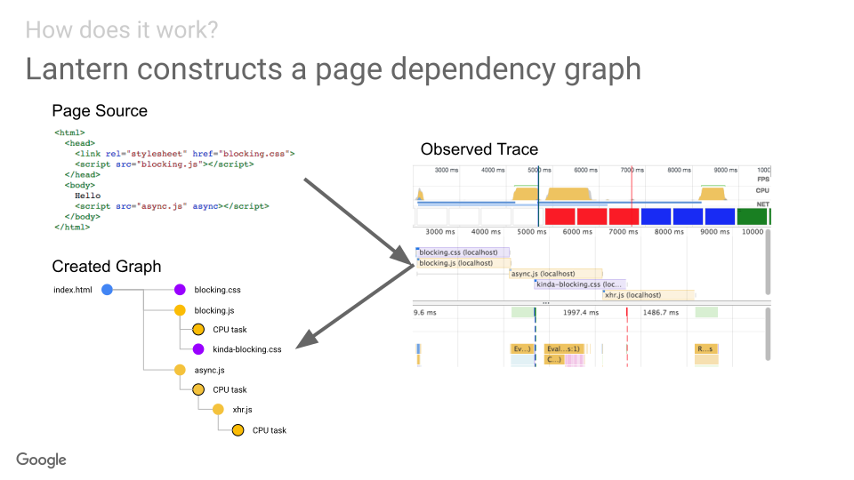
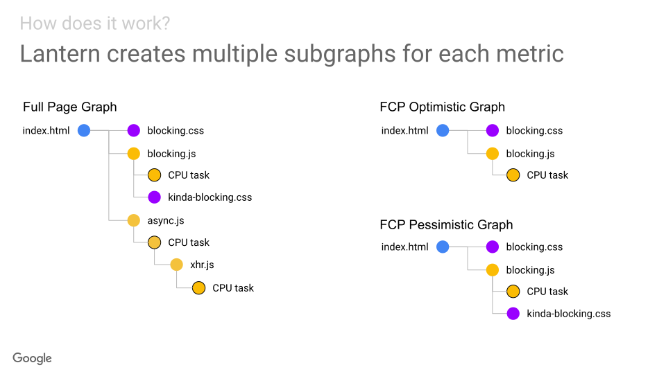
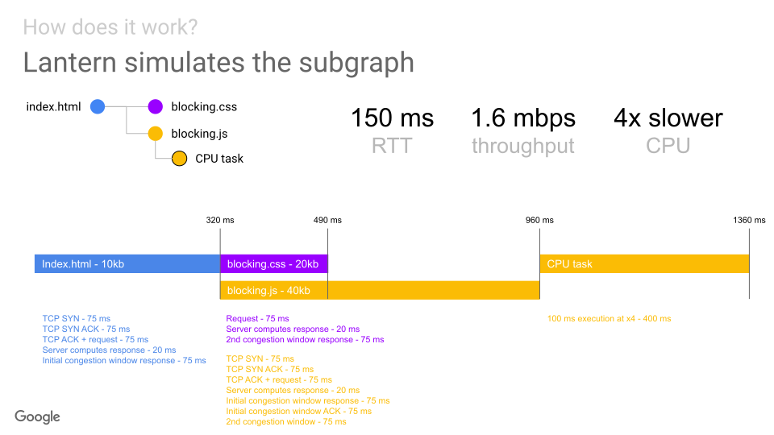

# What's in the Google PageSpeed score?

- [Overview](#overview)
  * [PageSpeed Insights score = Lighthouse score](#pagespeed-insights-score--lighthouse-score)
  * [The 5 metrics that affect the score](#the-5-metrics-that-affect-the-score)
  * [Metrics are estimated with Lantern](#metrics-are-estimated-with-lantern)
  * [Recommendations for using the score](#recommendations-for-using-the-score)
- [`pagespeed-score` cli](#pagespeed-score-cli)
  * [Local mode](#local-mode)
- [Reducing variability](#reducing-variability)
  * [Multiple runs](#multiple-runs)
  * [Force AB tests variants](#force-ab-tests-variants)
  * [Feature flags to turn off e.g. third party scripts](#feature-flags-to-turn-off-eg-third-party-scripts)
- [Identifying sources of variability](#identifying-sources-of-variability)
  * [Benchmark Index](#benchmark-index)
  * [Time to First Byte](#time-to-first-byte)
  * [User Timing marks and measures](#user-timing-marks-and-measures)
- [Identifying inaccuracies](#identifying-inaccuracies)
  * [Debug Lantern metrics estimation locally](#debug-lantern-metrics-estimation-locally)
- [How does Lantern estimate metrics?](#how-does-lantern-estimate-metrics)
  * [1. Create a page dependency graph](#1-create-a-page-dependency-graph)
  * [2. Create subgraph for each metric](#2-create-subgraph-for-each-metric)
  * [3. Simulate subgraph with emulated mobile conditions](#3-simulate-subgraph-with-emulated-mobile-conditions)

## Overview

### PageSpeed Insights score = Lighthouse score

The [Google PageSpeed Insights (PSI)](https://developers.google.com/speed/pagespeed/insights/) score is based on [Google Lighthouse (LH)](https://developers.google.com/web/tools/lighthouse/). **Lighthouse calculates the performance score on the scale of 0-100 based on 5 estimated metrics.** The score of 90-100 is fast, 50-89 is average and 0-49 is slow.

### The 5 metrics that affect the score

This is available in the [Lighthouse scoring documentation](https://github.com/GoogleChrome/lighthouse/blob/master/docs/scoring.md). See a summary of metrics, their weights in the score and their maximum values to achieve the score of 90 and 50 in the table below:

| Estimated Metric            | Weight |  90  |  50  | Description |
|:----------------------------|:------:|:----:|:----:|-------------|
| [First Contentful Paint (FCP)](https://github.com/csabapalfi/awesome-web-performance-metrics#first-contentful-paint-fcp) |    3   | 2.4s | 4.0s | when the first text or image content is painted |
| [First Meaningful Paint (FMP)](https://github.com/csabapalfi/awesome-web-performance-metrics#first-meaningful-paint-fmp) |    1   | 2.4s | 4.0s | when the primary content of a page is visible |
| [Speed Index (SI)](https://github.com/csabapalfi/awesome-web-performance-metrics#speed-index) |    4   | 3.4s | 5.8s | how quickly the contents of a page are visibly populated |
| [First CPU Idle (FCI)](https://github.com/csabapalfi/awesome-web-performance-metrics#first-cpu-idle) |    2   | 3.6s | 6.5s | when the main thread is first quiet enough to handle input |
| [Time to Interactive (TTI)](https://github.com/csabapalfi/awesome-web-performance-metrics#time-to-interactive-tti) |    5   | 3.8s | 7.3s | when the main thread and network is quiet for at least 5s |

**Other audits have no direct impact on the score** (but give hints to improve the metrics).

### Metrics are estimated with Lantern

**[Lantern](https://github.com/GoogleChrome/lighthouse/blob/master/docs/lantern.md) is the part of Lighthouse that estimates metrics. Lantern models page activity and simulates browser execution.** It can also emulate mobile network and CPU execution. The input data for the simulation is a performance trace captured without any throttling (hence the fast execution time).

There’s an [accuracy and variability analysis](https://docs.google.com/document/d/1BqtL-nG53rxWOI5RO0pItSRPowZVnYJ_gBEQCJ5EeUE/edit#) available. Lantern trades off accuracy but also mitigates certain sources variability. Metrics can be over/underestimated because of:

* differences in the unthrottled trace vs real device/throttling
* details ignored or simplified to make the simulation workable

### Recommendations for using the score

* Even if not 100% accurate **metrics in the red highlight genuine/urgent problems**
* Use the scores to **look for longer term trends and identify big changes**
* Reduce variability by forcing AB test variants, doing multiple runs, etc
* Keep in mind that even with reduced variability some inherent inaccuracies remain
* Use the `pagespeed-score` cli to reduce/identify variability and to investigate inaccuracies

## `pagespeed-score` cli

Command line toolkit to get a speed score and metrics via the Google PageSpeed Insights API or a local Lighthouse run. 

```
$ npx pagespeed-score https://www.google.com
name  	score	FCP	FMP	SI	FCI	TTI
run 1 	96	1.2	1.2	1.2	3.3	3.7
```

Use `--help` see the list of all options:

```shell
$ npx pagespeed-score --help
# soo many options it won't fit here
```

### Local mode

`--local` switches to running Lighthouse locally instead of calling the PSI API. This can be useful for non-public URLs (e.g. staging environment on a private network). To ensure the local results are close to the PSI API results this module:

  * uses the same version of LightHouse as PSI (5.0.0 as of 9 May 2019) 
  * uses the [LightRider mobile config](https://github.com/GoogleChrome/lighthouse/blob/master/lighthouse-core/config/lr-mobile-config.js)
  * allows throttling of CPU with `--cpu-slowdown` (default 4x). Please note that PSI infrastructure already runs on a slower CPU (that's like a mobile device) hence the need to slow our laptops CPU down for local runs.
  * you can also use the same Chrome version as PSI (75 as of 9 May 2019) by specifying CHROME_PATH

```sh
CHROME_PATH="/Applications/Google Chrome Canary.app/Contents/MacOS/Google Chrome Canary" \
npx pagespeed-score --local "<url>"
```

Local results will still differ from the PSI API because of local hardware and network variability.

## Reducing variability

### Multiple runs

Test multiple times and take the median (or more/better statistics) of the score to reduce the impact of outliers (independent of what’s causing this variability). 

You can use the `pagespeed-score` cli:

* `--runs <N>` overrides the number of runs (default: 1). For more than 1 runs stats will be calculated.

```
$ npx pagespeed-score --runs 3 https://www.google.com
name  	score	FCP	FMP	SI	FCI	TTI
run 1 	96	0.9	1.0	1.2	3.1	3.9
run 2 	96	0.9	1.0	1.0	3.1	3.7
run 3 	95	0.9	1.0	1.2	3.5	4.0

median	96	0.9	1.0	1.2	3.1	3.9
stddev	0.6	0.0	0.0	0.1	0.2	0.2
min   	95	0.9	1.0	1.0	3.1	3.7
max   	96	0.9	1.0	1.2	3.5	4.0
```

* `--warmup-runs <N>` add warmup runs that are excluded from stats (e.g. to allow CDN or other caches to warm up)

### Force AB tests variants

By making sure we always test the same variants of any AB tests running on the page we can ensure they don’t introduce [Page Nondeterminism](https://docs.google.com/document/d/1BqtL-nG53rxWOI5RO0pItSRPowZVnYJ_gBEQCJ5EeUE/edit#heading=h.js7k0ib0mzzv).

### Feature flags to turn off e.g. third party scripts

Sometimes variability is introduced by third party scripts or certain features on the page. As a last resort adding a flag to turn these off can help getting a more stable score. Ensure not to exclusively rely on the score and metrics captured like this as real users will still experience your page with all of these ‘features’ on.
 

## Identifying sources of variability

You can look at additional datapoints not directly taken into account for score calculation that can help in identifying sources of variability.

### Benchmark Index

Lighthouse computes a memory/CPU performance [benchmark index]((https://github.com/GoogleChrome/lighthouse/blob/master/lighthouse-core/lib/page-functions.js#L128-L154)) to determine rough device class. 

Variability in this can help identifying [Client Hardware Variability](https://docs.google.com/document/d/1BqtL-nG53rxWOI5RO0pItSRPowZVnYJ_gBEQCJ5EeUE/edit#heading=h.km3f9ebrlnmi) or [Client Resource Contention](https://docs.google.com/document/d/1BqtL-nG53rxWOI5RO0pItSRPowZVnYJ_gBEQCJ5EeUE/edit#heading=h.9gqujdsfrbou).

These are less likely to occur with PSI that uses a highly controlled lab environment and can affect local Lighthouse runs more.

You can use the `pagespeed-score` cli to monitor this:

* ` --benchmark` adds the benchmark index as a metric for each test run

### Time to First Byte

Time to First Byte (TTFB) has a very limited impact on the score but can be useful indicator of [Web Server Variability](https://docs.google.com/document/d/1BqtL-nG53rxWOI5RO0pItSRPowZVnYJ_gBEQCJ5EeUE/edit#heading=h.6rnl1clafpqn). 

Please note that TTFB is not estimated by Lantern but based on the observed/fast trace.

You can use the `pagespeed-score` cli to monitor this:

* ` --ttfb` adds TTFB as a metric for each test run

### User Timing marks and measures

We use a number of User Timing marks and high variability in these can mean you have [Page Nondeterminism](https://docs.google.com/document/d/1BqtL-nG53rxWOI5RO0pItSRPowZVnYJ_gBEQCJ5EeUE/edit#heading=h.js7k0ib0mzzv) or other sources variability.

Please note user timing marks are not estimated by Lantern but based on the observed/fast trace.

You can use the `pagespeed-score` cli to monitor them:

* `--usertiming-marks.<alias>=<name>` adds any User Timing mark named to your metrics with the name `alias` (e.g. `--usertiming-marks.DPA=datepicker.active`)

## Identifying inaccuracies

### Debug Lantern metrics estimation locally

Read [How does Lantern estimate metrics?](#how-does-lantern-estimate-metrics) first to have a better understanding of the details.

In case you want to understand why Lantern estimated a metric the way it did you can make Lighthouse save the traces resulting from the simulations:

```sh
LANTERN_DEBUG=true npx lighthouse --save-assets <url> 
```

Use the Chrome Devtools Performance tab to open the traces.

Subscribe to [lighthouse#5844](https://github.com/GoogleChrome/lighthouse/issues/5844) for future updates on this.

You can also use the `pagespeed-score` cli in [local mode](#local-mode) that has builtin support for this and also ensures that your lighthouse setup is as close to PSI as possible:

```sh
CHROME_PATH="/Applications/Google Chrome Canary.app/Contents/MacOS/Google Chrome Canary" \
npx pagespeed-score --local --save-assets --lantern-debug "<url>"
```

## How does Lantern estimate metrics?

Lantern is an ongoing effort to reduce the run time of Lighthouse and improve audit quality by modeling page activity and simulating browser execution. Metrics are estimated based on:

* capturing an unthrottled network and CPU trace (usually referred to as observed trace)
* simulating browser execution (with emulated mobile conditions) using relevant parts of the trace

See detailed breakdown of steps below.

### 1. Create a page dependency graph

* Lighthouse loads the page without any throttling
* A dependency graph is built based on the network records and the CPU trace
* Any CPU tasks and network requests related to each other are linked up
* See [lighthouse-core/computed/page-dependency-graph.js](https://github.com/GoogleChrome/lighthouse/blob/master/lighthouse-core/computed/page-dependency-graph.js)

> 

(via [Project Lantern Overview - slide 7](https://docs.google.com/presentation/d/1EsuNICCm6uhrR2PLNaI5hNkJ-q-8Mv592kwHmnf4c6U/edit?zx=ksqkx77n311n#slide=id.g2ab7b9a053_0_467) by [@patrickhulce](https://github.com/patrickhulce))

### 2. Create subgraph for each metric

* CPU and network nodes are filtered to create a subgraph with only the nodes contributing to the delay of a specific metric
* e.g. based on the comparing node end timestamps with observed (unthrottled) metric timestamps
* See [lighthouse-core/computed/metrics/lantern-*](https://github.com/GoogleChrome/lighthouse/tree/master/lighthouse-core/computed/metrics)

> 

(via [Project Lantern Overview - slide 8](https://docs.google.com/presentation/d/1EsuNICCm6uhrR2PLNaI5hNkJ-q-8Mv592kwHmnf4c6U/edit?zx=ksqkx77n311n#slide=id.g2ab7b9a053_0_503) by [@patrickhulce](https://github.com/patrickhulce))

### 3. Simulate subgraph with emulated mobile conditions

* Simulate browser execution for each metric subgraph
* DNS caching, TCP slow start, Connection pooling, and lots more implemented...
* See [lighthouse-core/lib/dependency-graph/simulator/simulator.js](https://github.com/GoogleChrome/lighthouse/blob/master/lighthouse-core/lib/dependency-graph/simulator/simulator.js)

> 

(via [Project Lantern Overview - slide 9](https://docs.google.com/presentation/d/1EsuNICCm6uhrR2PLNaI5hNkJ-q-8Mv592kwHmnf4c6U/edit?zx=ksqkx77n311n#slide=id.g2ab7b9a053_0_845) by [@patrickhulce](https://github.com/patrickhulce))

